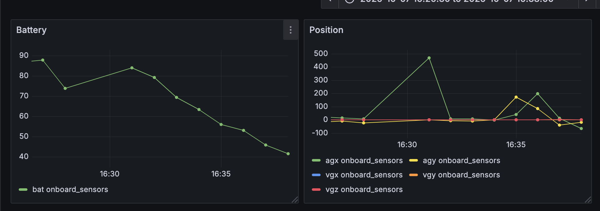

# Drone Monitoring System

Using Grafana and Kafka to monitor commercial drone flight data, such as battery and velocity

## Usage Guide

Turn your Tello drone on and connect to its WiFi (station mode does not support the camera, so don't use it)

Run `./drive_drone` to drive drone.

Run `drone_state_producer.py` and `consumer.py` to track drone state using Kafka

Flight data is now live and available on the default Grafana port

Note: most flights are less than five minutes, so adjust Grafana dashboard config accordingly
